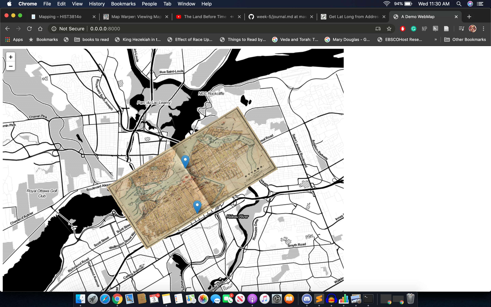
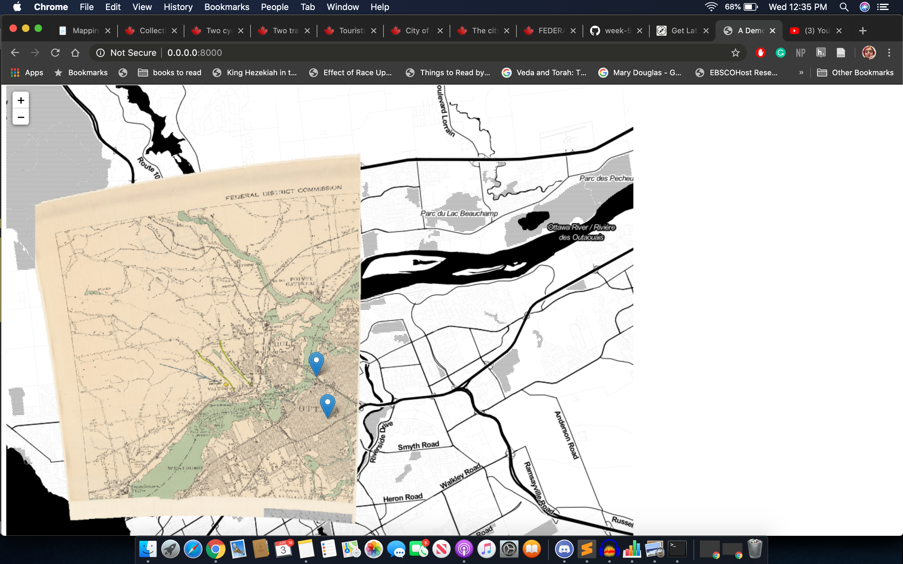
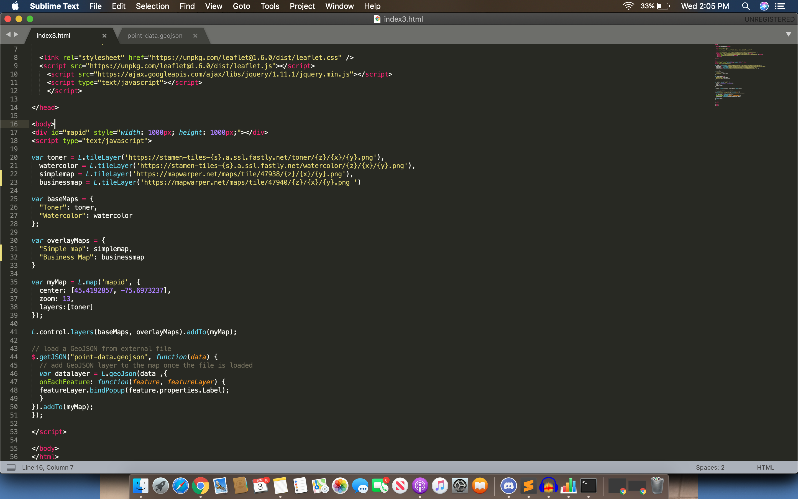
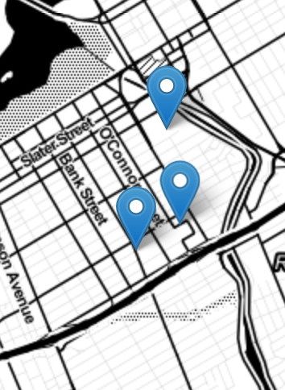
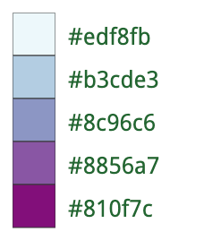
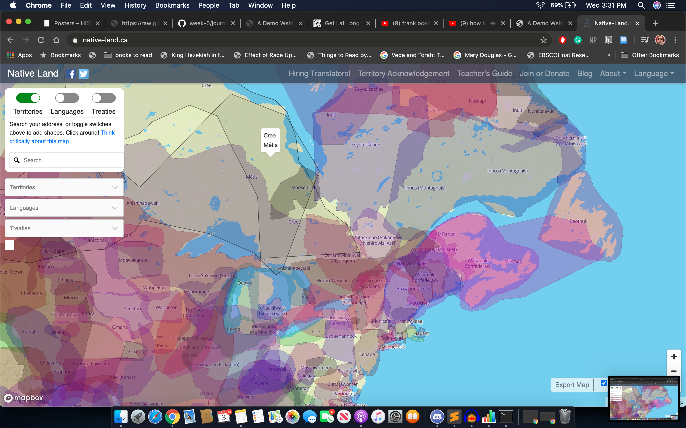

# Week 5 Journal

### Readings
- The introductory musical piece was fascinatingly good. I fell down a rabbit hole reading, and listening to “Assemblage Theory.” 
- Looking at the [digital panopticon](https://www.digitalpanopticon.org/search?targ=multipie&e0.type.t.t=root&e0.has_tattoo.tty.x=yes&tf-multipie-start=sentence&tf-multipie-end=tattoo_subjects), I found navigating its search criteria slightly confusing. I tried to search within the “executed” category for a long time before realizing that it wasn’t, as I assumed, but because there [was actually none,](https://www.digitalpanopticon.org/search?e0.type.t.t=root&e0.given.s.s=&e0.surname.s.s=&e0._all.s.s=&e1.type.t.t=executed&e1.date.d.ld=&e1.date.d.lm=&e1.date.d.ly=&e1.date.d.hd=&e1.date.d.hm=&e1.date.d.hy=) as none of the nearly 2500 executed convicts are recorded as having tattoos. 
- [This](https://datasittersclub.github.io/site/dsc4/) article on *The Data-Sitters Club*, from the DH Awards web page, was a good example of the type of literary analysis work topic modelling can assist us with, and as an english minor it intrigued me quite a lot. The author’s suggesting that “the books might be modelling for the reader in a discursive way one of the forms of emotional labor that women are socialized to do in daily life: regulating other people’s emotions for them” emerged from using AntConc to detect instances of “a little” modifying positive or negative terms. 
- I also explored the Queer History Project for a bit, bookmarking [this](https://gizmodo.com/how-90s-cybersex-pioneers-looked-for-action-and-found-c-1831079932) article for later. 

### Audio Mediums
- Audacity— I’ve had this installed on previous machines for small recording projects of my own and I was quite excited to get back into it! 
- Two-Tone— I played around with the provided data and created this short piece: I chose A major because I liked the bouncy feeling the more unusual tonic provided. I played around with some of the different instruments but they mostly just added to the dissonance of it, which I did try to minimize. Instead, I went with 3 lines of melody, 1 bass (for the material) and 2 piano (for the coins). Of the piano lines, I set one to play only the higher notes, using the “filter value” scale, and made its tempo x2, so that it effectively added emphasis to those wealthier (in coin) cities. I kept the bass at a x2 tempo mainly because I just liked the way it sounded— it made the fact that the notes rarely change less of a bug and more of a feature, a gentle *ostinato* supporting the piece. I just wish I could tamper with the notes a little bit to give it more of a feeling of resolution… 

[my sonification](sonification-roman-data.mp3)

### Story Mapping
- To get my gills wet I mucked up a quick silly map of the dour-faced selfies I took across western Europe last summer:

[Here it is:](https://zoe-f-cyborg.github.io/week-5/storymap.html)

<iframe src="https://uploads.knightlab.com/storymapjs/3f10e63fc07b3d0e9fe302f2e4b512f2/hello-world/index.html" frameborder="0" width="100%" height="1200"></iframe>

#### Using Leaflet
- Copying and pasting the source code, this worked fine, but when I tried to make adjustments by altering the coordinates for “this is the center of our map!” and changing the pixel length of the final display map, it no longer loaded anything. I’m not sure if this is because of something I did to the code without realizing it (the long and lat numbers I entered where a digit shorter than the originals, for example, because that’s all the website I was using counted), or because I “terminated session” in terminal so that I could try again, even though it seemed to still be processing something. 
    - Update: There were a few reasons, I think:
    - 1. I hadn’t navigated back to web-map in terminal when I reopened it— I have to remember to `cd documents/digital-history/week-5/web-map` every time.
    - 2. In the Json code, I had removed the spaces on either end of the coordinates within the brackets, so it read `"coordinates":  [-75.693207, 45.411491]` instead of `"coordinates":  [ -75.693207, 45.411491  ]` like the original code. 
    - With those fixed, it generated a new map beautifully! Now a box of 1000 pixels by 1000 pixels, denoting the location of the YMCA. 

- (this image has the old ottawa map overlay, because I forgot to take a screenshot of the earlier stages)

#### Map Warping
- the begin, I chose a [simple](https://www.bac-lac.gc.ca/eng/CollectionSearch/Pages/record.aspx?app=fonandcol&IdNumber=2163337&new=-8586104077399913864) image of a flat map

- I added many control points.

- And I rectified it, then added it (https://mapwarper.net/maps/tile/47938/{z}/{x}/{y}.png) to my leaflet map. 

- It looks good, though I’m… not entirely sure that that *is* where the YMCA is. I decided to add the location of my old high school (Lisgar Collegiate Instatute), grabbing the approximate latitude and longitude from [latlong.net](https://www.latlong.net/convert-address-to-lat-long.html). 

- It’s certainly quite close, so although I wouldn’t use this map for extremely precise examination, it gives a pretty good general sense of space.

- I wanted to also try out a [more challenging](https://www.bac-lac.gc.ca/eng/CollectionSearch/Pages/record.aspx?app=fonandcol&IdNumber=4140195&new=-8586104062217727912) (and fun) image, this 3d illustration of an arial view of the city, highlighting major businesses

- That, er, doesn’t look right. It actually looked alright in preview before I added point 8— the canal just didn’t quite line up with itself. Which makes me realize the green-yellow-red of the location points probably indicates something about the accuracy of my choices?? Interesting. 
- I was able to delete point 8 and got a much better image. I fidgeted with it for a while, deleting and adding points, until I settled on a less is more philosophy and kept only 4 points. Final url: https://mapwarper.net/maps/tile/47940/{z}/{x}/{y}.png 

- The maps still don’t line up as well as I would like, however, so I was excited to move on to stage where I would be able to toggle the overlay on and off. 

#### Overlays and animations
- Following the tutorial, the code definitely worked, though I’m confused why the lumber district map is so small?!?!
- I also created a version using the maps I had rectified, renaming the variables to “simple map” and “business map”

- I was able to add the animation easily— Overall I’ve been quite surprised by how forgiving this system seems to be, as I didn’t have any major roadblocks! 
- I decided to animate the route from Lisgar Collegiate to the YMCA. My points were: 
`-75.689964, 45.420504
-75.691992, 45.419796
-75.687063, 45.414042
-75.693207, 45.411491`
- I added those into the code, creating the final map (which I wish I knew how to export and show here). It lined up with the streets very well, as I hoped it would.

### Inkscape
- In Inkscape, I explored the various ways I was able to manipulate a vector image, changing the font of the title and axis headings from Helvetica to Malayalam MN, and rotating the numbers on the y-axis 
- I ran into some trouble creating my own palette, which was going to be this one:


- I attempted to use one of the preloaded palettes, but given the range of hues found it tiring— I wanted to use the intensity of the colours to emphasis the number of articles, but found the fact that I had to eyeball which bar got which colour meant that it wasn’t guaranteed to be consistent. 
- I’m not entirely clear on why this application is better than any other photo-shopping app (like Gimp, which also has layers/text/colour fill), besides the fact that it manipulates vector images. It was definitely a bit clunky to get familiar with. 

### Posters!
- This brings me back to my high school volunteer gig with planned parenthood— waiting around in their offices was always entertaining because there would be different infographic posters and pamphlets *everywhere*. Bright, short, colourful, yet dense, often highlighting one or two statistics, and always with a direct and overt message, these designs always intrigued me. This is largely what I modelled my 
- For my poster, I decided to adapt a “paper” that wasn’t really a paper to begin with, but a [podcast](soundfile) I did with a friend of mine on the historical origin and symbolic meaning of the Jewish Passover Seder. For this “paper” I did research both by reading books which theorized about the potential origin of the various ritual elements, and by talking about the significance of those elements to us in the modern day (her as an in-progress convert, me as an atheist jew). This struck me as a subject which could be visualized in a very entertaining way, by visualizing the seder plate and annotating every element with information about its origin and significance. I also hope that this format will be conducive to capturing the spirit of play and exploration which I find to be so essential to the holiday. 
- First, I had to organize my data into a new document to figure out what I wanted to include in my final poster. I created [a google doc](https://docs.google.com/document/d/1q-l_8hEQsNyJeoaT-JWgs46Ro7SpOO_G-KqOv4gztqQ/edit?usp=sharing) with a short introduction, a description (varying in length) of each ritual food, and a short section on the major historical influences of the holiday. 
- Then, I found clipart for each of the ritual foods, documenting my sources in the google doc. 
- I added the bibliography from my podcast and created a short url to the podcast itself (I tried to upload it to github but the file was too large). 
- Voila!

- While this poster does provide a basic introduction to the seder plate, it also contains some falsehoods and simplifications— it makes it look like the matzah is an element that is actually on the plate rather than beside or underneath it, and it fails to talk about the “karpas” or vegetable element of the plate. This is because it is largely based on my own family’s approach to passover, which often skips the vegetable/combines it with the bitter herbs. 

#### Conclusion
- This project was some fo the most fun I’ve had in this course! The code was surprisingly forgiving and although I wouldn’t have been able to construct it myself, I felt fairly comfortable manipulating it as needed. 
- There is a lot more I could imagine doing with this type of technology, and indeed which has been done: 
- Recently [a friend of mine](https://twitter.com/clairequaclaire/status/1267554737466953733) put out on a poll on twitter asking if I was living on unceceded or treaty land. I assumed unceceded because that’s what they always say before public theatre performances and other events here. But when [I googled it](https://native-land.ca/) I found a website mapping aboriginal communities, languages, and treaties, which suggested that my current location was actually part of the “Crawford Purchase” of 1783. [Nicknamed “the gunshot treaty”](http://www.stoneskingston.ca/indigenous-history/the-crawford-purchase/) its boundaries were supposedly “determined by how far the sound of a gunshot carried.” This struck me as the type of historical data particularly suited to mapping. I was especially interested in how different areas (both of aboriginal territories and treaty boundaries) sometimes overlaid one another— a contradiction which becomes obvious when mapped! 

